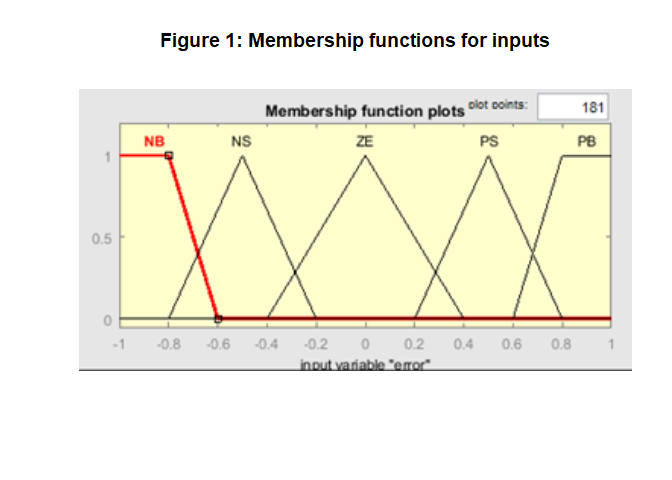
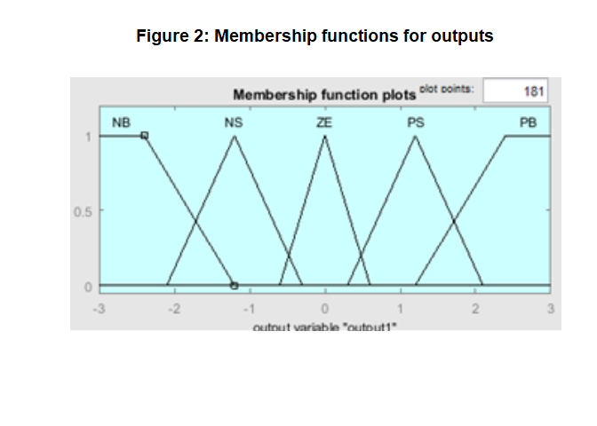
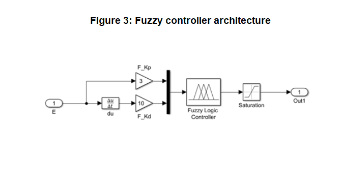
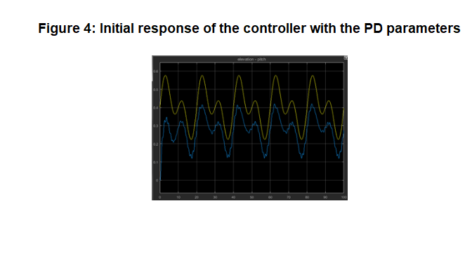
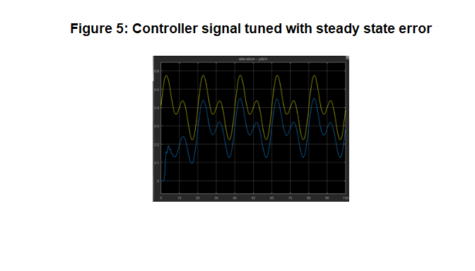
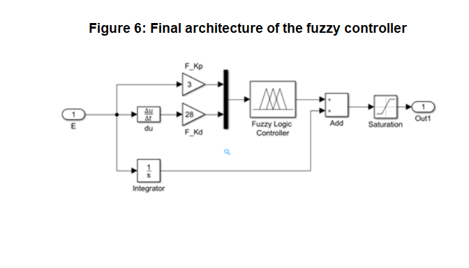
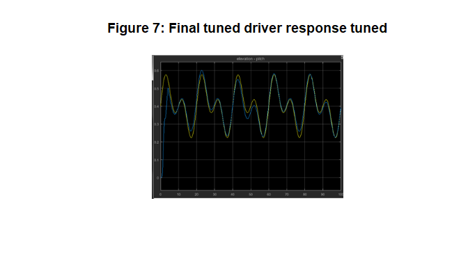
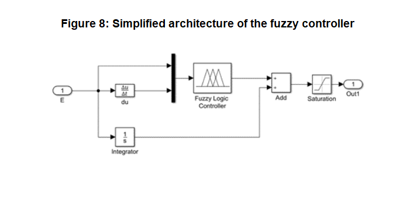

Fuzzy control of the Twin Rotor Mimo System
================
Andres Fernando Garcia
6/10/2021

## Project details

This project use the Twin Rotor MIMO System (TRMS) equipment of Feedback
Instruments Ltd. (more information about it in [this
link](http://www.cpdee.ufmg.br/~palhares/33-942rotor.pdf)). The aim of
the project is to replace the PID controllers, supplied with the
equipment, by fuzzy controllers. The Takagi-Sugeno controller seems a
good option since it would be modeled to the PID control with a diffuse
system, but to avoid obtaining the PID response curve, the controllers
of the Mamdani type were chosen.

The typical rules of a diffuse Mamdani type controller are:

If **e1** is **A** and **e2** is **B** then **z** is **C**

Where **e1** and **e2** are the input signals with membership functions
**A** and **B**. **z** is the output signal with membership function
**C**. The selected architecture is based on the fuzzy PD-type
controllers shown in the article *[Designing a Fuzzy-like PD controller
for an underwater robot](http://hamzib.free.fr/Articles/science15.pdf)*,
where the error signal and the error rate signal are used as inputs of
the controllers and the fuzzy rules are given as:

| e/de | NB | NM | NS | ZE | PS | PM | PB |
| :--: | :-: | :-: | :-: | :-: | :-: | :-: | :-: |
|  NB  | NB | NB | NB | NB | NM | NS | ZE |
|  NM  | NB | NB | NB | NM | NS | ZE | PS |
|  NS  | NB | NB | NM | NS | ZE | PS | PM |
|  ZE  | NB | NM | NS | ZE | PS | PM | PB |
|  PS  | NM | NS | ZE | PS | PM | PB | PB |
|  PM  | NS | ZE | PS | PM | PB | PB | PB |
|  PB  | ZE | PS | PM | PB | PB | PB | PB |

Table 1: Controller fuzzy rule set

Membership functions are defined as **NB** (Negative Big), **NM**
(Negative Medium), **NS** (Negative Small), **ZE** (Zero), **PS**
(Positive Small), **PM** (Positive Medium), and **PB** (Positive Big).

## Results

To tune the fuzzy controllers, we started with the proportional and
derivative gains of the PID controller. The gains are adjusted using the
trial and error technique. The architecture of the controller and the
initial response of it can be seen in the following figures:

Once the gains are tuned, there is an answer that has a steady state
error as shown in Figure 5.

To remove the steady state error, simply add the signal corresponding to
the integral of the error to the fuzzy controller output:

Tuned gains can be entered into the fuzzy controller block by changing
the limits of the input signals (\[1/3 1/3\] and \[1/28 1/28\] in the
case of the fuzzy controller for the pitch) and thus remove the
proportional and derivative gains of the controller architecture.

